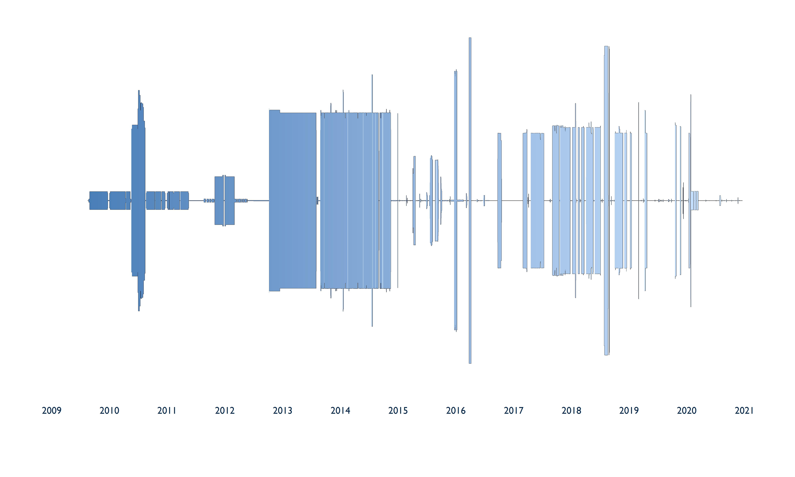

# distance-audiowave-visualization

This repository contains the code to create an artistic "audio wave" visualization of the distance between two GPS points over time. 

The figure below displays the geographic distance between me and my partner (vertical axis) from the time we met in 2009 to December 2021. From 2009 to about 2014, I approximated our respective GPS locations from memory/travel records. After 2014, I used the Google Location History data from our mobile phones. I calculated the distance between our two locations using the Haversine formula, and reflected it across the x-axis.

## Steps

1. Follow the instructions on this [site](https://www.howtogeek.com/725241/how-to-download-your-google-maps-data/) to download your Google location history data. 
2. Save the unzipped "Location History" folder for each person into data/Individual1 and data/Individual2.
3. Run R/prepare-R-session
4. Run R/plot-googlehistorydata

**Shortcut**: The Google location history data can be very large and take a long time to download. I've also included a [script](https://github.com/hallieeilerts/distance-audiowave-visualization/blob/main/R/plot-example.R) that produces a simple version of the plot using dummy location history data.